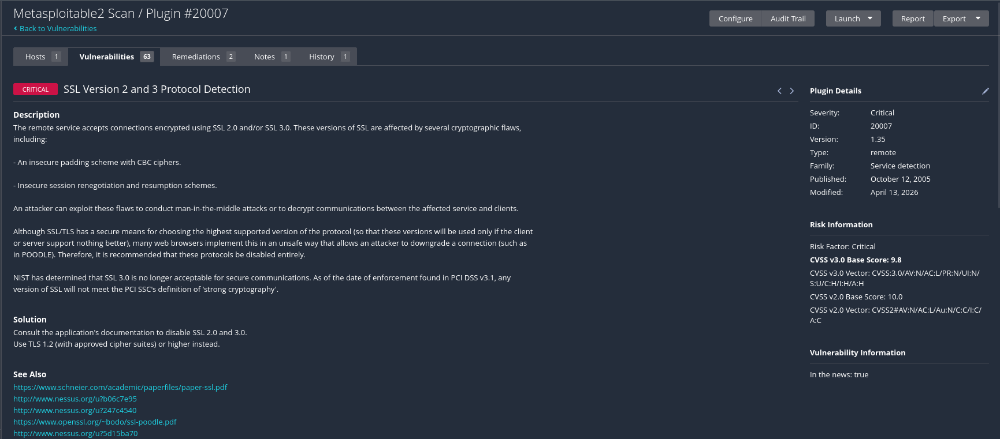

| Details | Information |
|---|---|
| Name | Haziq Danial Bin Nor Azan |
| Student ID | 52215225213 |
| Programme | Bachelor Of Information Technology (Hons) In Computer System Security |
| Course | IKB21403 - Vulnerability Analysis |
| Lecturer | Nor Adani Kamal Mohamad Nasir |

---

# IKB21403 — Vulnerability Analysis (Week 10)

## Lab Reports

| Folder | Lab | Focus |
|---|---|---|
| [Lab1_Foundation/](Lab1_Foundation/) | Lab 1 — Foundation | Nessus scan, identify Top 5 vulnerabilities |
| [Lab2_Core_Analyst_Skill/](Lab2_Core_Analyst_Skill/) | Lab 2 — Core Analyst Skill | CVE research, CVSS vector breakdown, CWE mapping |
| [Lab3_Real_World_Scenario/](Lab3_Real_World_Scenario/) | Lab 3 — Real-World Scenario | Manual validation, True/False Positive verdicts |
| [Lab4_Advanced/](Lab4_Advanced/) | Lab 4 — Advanced | Risk scoring (E × I × Ex), remediation priority list |

---

## Lab Environment

| Component | Description |
|---|---|
| Attacker Machine | Kali Linux |
| Victim Machine | Metasploitable2 |
| Network Type | VirtualBox Host-Only Network |
| Victim IP Address | 192.168.56.106 |
| Scan Tool | Nessus Essentials v10.x |

---

*IKB21403 Vulnerability Analysis · UniKL MIIT · 2026*


# Lab 1 — Foundation (Vulnerability Scanning)

## Objective

Perform a host-based vulnerability scan against Metasploitable2 using Nessus Essentials. Identify, classify, and document the Top 5 vulnerabilities found. No exploitation is performed in this lab.

---

## Lab Environment

| Component | Description |
|---|---|
| Attacker Machine | Kali Linux |
| Victim Machine | Metasploitable2 |
| Network Type | VirtualBox Host-Only Network |
| Victim IP Address | 192.168.56.106 |
| Scan Tool | Nessus Essentials v10.x |
| Scan Template | Basic Network Scan |

---

## Step 1 — Verify Network Connectivity

Before running any scan, confirm that Kali Linux can reach Metasploitable2.

**Command Used:**

```bash
ping 192.168.56.106
```

**What this does:**
- Sends ICMP echo requests to the target IP
- If replies come back, the target is alive and reachable
- Required before launching any scan — no point scanning a host you cannot reach

**Expected output:**

```
64 bytes from 192.168.56.106: icmp_seq=1 ttl=64 time=0.XXX ms
```

<p align="center">
  
</p>

---

## Step 2 — Open Nessus Essentials

Open the browser on Kali Linux and go to:

```
https://localhost:8834
```

Log in with your Nessus credentials.

**Note:** Nessus uses HTTPS on port 8834. If you see a certificate warning, click **Advanced → Accept the Risk** and continue.

---

## Step 3 — Create a New Scan

1. Click **New Scan** on the top right
2. Select **Basic Network Scan** from the templates
3. Fill in the scan settings:

| Field | Value |
|---|---|
| Name | Lab 1 — Metasploitable2 Scan |
| Targets | 192.168.56.106 |

4. Click **Save**

**Why Basic Network Scan?**
It checks for common vulnerabilities across all ports and services without requiring credentials. This is an unauthenticated scan — simulates what an outside attacker would see.

---

## Step 4 — Launch the Scan

1. Click the **Play (▶)** button next to your saved scan
2. Wait for the scan to complete — approximately **20 minutes**
3. The scan runs from: `09:27 AM` to `09:47 AM`

**Do not close Nessus or the browser while the scan is running.**

---

## Step 5 — Review the Executive Summary

Once the scan finishes, click on the scan name to open the results.

<p align="center">
  
</p>

**Scan results overview:**

| Category | Details |
|---|---|
| Overall Risk Level | **CRITICAL** |
| Total Vulnerabilities Found | **63** |
| Critical Findings | 4 |
| High Findings | 2 |
| Medium Findings | 3 |
| Scan Duration | 20 minutes |
| Target IP | 192.168.56.106 |

**Biggest concern:** Bind Shell Backdoor on port 1524 and VNC service with password `password`. Both allow unauthenticated remote root access with zero skill required.

---

## Step 6 — Review Key Weaknesses

Key weaknesses found on the target:

- Operating system Ubuntu 8.04 reached End-of-Life — no security patches ever again
- VNC service on port 5900 uses the password `password` — trivially exploitable
- Bind Shell Backdoor on port 1524 — anyone who connects gets a root shell immediately
- SSL version 2 and 3 are enabled — vulnerable to POODLE and downgrade attacks
- Samba service is vulnerable to CVE-2016-2118 (Badlock)

---

## Step 7 — Review Scope and Methodology

This assessment followed **NIST SP 800-115** methodology.

**Scope Exclusions — the following were NOT performed:**
- No exploitation of discovered vulnerabilities
- No Denial of Service (DoS) attacks
- No social engineering attempts
- Assessment limited to `192.168.56.106` only

---

## Step 8 — Understand the Methodology Phases

The assessment followed 5 phases:

| Phase | Action |
|---|---|
| 1. Network Confirmation | `ping 192.168.56.106` — verify connectivity |
| 2. Scan Configuration | Create Basic Network Scan in Nessus targeting the IP |
| 3. Vulnerability Scanning | Launch scan, wait ~20 minutes |
| 4. Analysis | Sort results by severity, select Top 5 for detailed review |
| 5. Reporting | Document findings with CVE ID, CVSS score, impact, and remediation |

---

## Step 9 — Identify Top 5 Findings

Sort Nessus results by **Severity** (highest first).

<p align="center">
  
</p>

| ID | Vulnerability Name | CVE | CVSS | Severity | Port |
|---|---|---|---|---|---|
| F-01 | Canonical Ubuntu Linux SEoL (8.04.x) | N/A | 10.0 | CRITICAL | General |
| F-02 | VNC Server 'password' Password | N/A | 10.0 | CRITICAL | 5900/tcp |
| F-03 | SSL Version 2 and 3 Protocol Detection | N/A | 9.8 | CRITICAL | 25/tcp, 5432/tcp |
| F-04 | Bind Shell Backdoor Detection | N/A | 9.8 | CRITICAL | 1524/tcp |
| F-05 | Samba Badlock Vulnerability | CVE-2016-2118 | 7.5 | HIGH | 445/tcp |

**CVSS Rating Reference:**

| Version | Low | Medium | High | Critical |
|---|---|---|---|---|
| CVSS v2.0 | 0.0–3.9 | 4.0–6.9 | 7.0–10.0 | — |
| CVSS v3.0 | 0.1–3.9 | 4.0–6.9 | 7.0–8.9 | 9.0–10.0 |

---

## Step 10 — Analyse F-01: Ubuntu Linux End-of-Life

<p align="center">
  
</p>

| Field | Details |
|---|---|
| CVE ID | N/A (Nessus plugin detection) |
| CVSS Score | 10.0 Critical — CVSS v2.0 |
| CVSS Vector | `CVSS2#AV:N/AC:L/Au:N/C:C/I:C/A:C` |
| Port | General (OS-level) |
| False Positive? | No — Ubuntu 8.04 officially EOL on April 9, 2013 |

**Description:**
Ubuntu 8.04 (Hardy Heron) has reached End-of-Life. Canonical no longer releases any security patches for it. Every new CVE discovered from now on will remain permanently unpatched.

**Impact:**
- No security patches will ever be released again
- All existing known vulnerabilities remain permanently exploitable
- Any new kernel or OS-level CVE = guaranteed unpatched exposure

**Remediation:**
- Upgrade to Ubuntu 22.04 LTS or 24.04 LTS immediately
- If upgrade is not possible now, isolate system from all networks

---

## Step 11 — Analyse F-02: VNC Weak Password

<p align="center">
  
</p>

| Field | Details |
|---|---|
| CVE ID | N/A (Nessus Plugin ID: 61708) |
| CVSS Score | 10.0 Critical — CVSS v2.0 |
| CVSS Vector | `CVSS2#AV:N/AC:L/Au:N/C:C/I:C/A:C` |
| Port | 5900/tcp (VNC) |
| False Positive? | No — Nessus successfully authenticated using password `password` |

**Description:**
VNC service on port 5900 is configured with the password `password`. Nessus logged in automatically and confirmed full graphical desktop access as root.

**Impact:**
- Full graphical desktop control as root — attacker can do anything
- Zero technical skill required — just open a VNC client and type `password`
- Can be used as a launch point to attack other machines on the network

**Remediation:**
- Change VNC password to minimum 16-character complex password immediately
- Block port 5900 via firewall — allow only trusted IP addresses
- Consider disabling VNC entirely if remote GUI access is not needed

---

## Step 12 — Analyse F-03: SSL v2/v3 Detection

<p align="center">
  
</p>

| Field | Details |
|---|---|
| CVE ID | N/A (Plugin ID: 20007) |
| CVSS Score | 9.8 Critical — CVSS v3.0 |
| CVSS Vector | `CVSS:3.0/AV:N/AC:L/PR:N/UI:N/S:U/C:H/I:H/A:H` |
| Port | 25/tcp (SMTP), 5432/tcp (PostgreSQL) |
| False Positive? | No — SSLv2 and SSLv3 confirmed enabled on target |

**Description:**
The target accepts connections using SSL v2.0 and SSL v3.0, both of which are cryptographically broken. SSLv3 is vulnerable to the POODLE attack (CVE-2014-3566).

**Impact:**
- Attacker can perform MITM attacks to intercept and decrypt encrypted traffic
- Credentials and data sent over SMTP or PostgreSQL may be exposed

**Remediation:**
- Disable SSLv2 and SSLv3 on all services
- Enforce TLS 1.2 minimum on SMTP and PostgreSQL
- Reference: NIST SP 800-52 Rev. 2

---

## Step 13 — Analyse F-04: Bind Shell Backdoor

<p align="center">
  
</p>

| Field | Details |
|---|---|
| CVE ID | N/A (Plugin ID: 51988) |
| CVSS Score | 9.8 Critical — CVSS v3.0 |
| CVSS Vector | `CVSS:3.0/AV:N/AC:L/PR:N/UI:N/S:U/C:H/I:H/A:H` |
| Port | 1524/tcp |
| False Positive? | No — Nessus executed `id` and received `uid=0(root) gid=0(root)` |

**Description:**
A bind shell backdoor is listening on port 1524. It provides root shell access to anyone who connects — no password, no exploit code, nothing.

**Command to verify (from Kali):**

```bash
nc 192.168.56.106 1524
```

**Expected result:** Immediate `#` root shell prompt with no login required.

**Impact:**
- Immediate root shell — complete system compromise
- Can read `/etc/shadow`, install rootkits, pivot to other hosts
- System may already be compromised — backdoor presence suggests prior breach

**Remediation:**
- Block port 1524 via firewall **immediately — same day**
- Find and kill the backdoor process: `netstat -tlnp | grep 1524`
- Conduct full forensic investigation before trusting anything on this host
- Consider full system rebuild from clean image

---

## Step 14 — Analyse F-05: Samba Badlock

<p align="center">
  
</p>

| Field | Details |
|---|---|
| CVE ID | CVE-2016-2118 |
| CVSS Score | 7.5 High — CVSS v3.0 |
| CVSS Vector | `CVSS:3.0/AV:N/AC:H/PR:N/UI:R/S:U/C:H/I:H/A:H` |
| Port | 445/tcp (CIFS/SMB) |
| False Positive? | No — Nessus confirmed Samba Badlock patch not applied |

**Description:**
Samba is running a version affected by CVE-2016-2118 (Badlock). A MITM attacker who intercepts SMB traffic between a client and the Samba server can force a downgrade of authentication, gaining access to the SAM database.

**Impact:**
- MITM attacker can read/modify SAM database contents
- Potential privilege escalation if admin shares are accessed

**Remediation:**
- Upgrade Samba to version 4.2.11 / 4.3.8 / 4.4.2 or later
- If Samba is not needed, disable it entirely
- Reference: https://www.samba.org/samba/security/CVE-2016-2118.html

---

## Step 15 — Remediation Priority Table

Ordered by urgency — **not CVSS score**:

| Priority | Finding | Timeline | Remediation Action |
|---|---|---|---|
| IMMEDIATE | F-04: Bind Shell Backdoor | Same day | Block port 1524, kill process, full forensic investigation |
| IMMEDIATE | F-02: VNC Weak Password | Same day | Change password, restrict port 5900 via firewall |
| SHORT-TERM | F-01: Ubuntu EOL | 1–2 weeks | Upgrade OS to Ubuntu 22.04 LTS |
| SHORT-TERM | F-03: SSL v2/v3 | 1 month | Disable SSLv2/v3, enforce TLS 1.2 on all services |
| SHORT-TERM | F-05: Samba Badlock | 1 month | Upgrade Samba to patched version 4.2.11+ |

---

## Step 16 — Conclusion

The overall risk posture of Metasploitable2 (`192.168.56.106`) is **CRITICAL**.

63 total vulnerabilities were found. The most dangerous are:
- **F-04 Bind Shell Backdoor** — one `nc` command = root shell, no auth
- **F-02 VNC Weak Password** — one VNC connection = full desktop as root
- **F-01 Ubuntu EOL** — every new CVE will never be patched

> ⚠️ Metasploitable2 is an **intentionally vulnerable** virtual machine for security training only. Never deploy in production or connect to an untrusted network.

---

## Key Learning

- **CVSS score** = technical severity in an ideal scenario
- **Real risk** = CVSS + how exploitable is it HERE + how exposed is the service
- A CVSS 9.8 vulnerability that needs MITM may be less urgent than a CVSS 7.5 with a direct one-command exploit
- This concept is explored in depth in **Lab 4**

---

*IKB21403 Vulnerability Analysis · UniKL MIIT · 2026*

---

# Lab 2 — Core Analyst Skill (CVE / CVSS / CWE Research)

## Objective

Manually research 3 vulnerabilities from Lab 1 using CVE.org and NVD. For each finding, break down the CVSS vector string metric by metric, map it to a CWE, and evaluate whether it is actually exploitable in the lab environment.

> A scanner gives you a number. A professional analyst understands what that number means — and whether those conditions exist in your environment.

---

## Lab Environment

| Component | Description |
|---|---|
| Attacker Machine | Kali Linux |
| Victim Machine | Metasploitable2 |
| Network Type | VirtualBox Host-Only Network |
| Victim IP Address | 192.168.56.106 |

---

## Vulnerabilities Selected

| # | Vulnerability | CVE | Category |
|---|---|---|---|
| 1 | Samba Badlock | CVE-2016-2118 | Protocol / Service |
| 2 | SSL POODLE | CVE-2014-3566 | Cryptographic |
| 3 | VNC Weak Password | No CVE | Authentication / Configuration |

---

## Step 1 — Understand the Objective

This lab trains analysts to not blindly trust scanner output. The key question for each finding is:

**"Even though CVSS says X, is this actually exploitable HERE?"**

Factors that affect real exploitability:
- Is the vulnerable service actually running?
- Is the port reachable from the attacker machine?
- Does the attack require special conditions (MITM, active session, credentials)?
- Are those conditions realistic in this specific lab environment?

---

## Step 2 — Research Finding 1: Samba Badlock (CVE-2016-2118)

**Research source:** `https://nvd.nist.gov/vuln/detail/CVE-2016-2118`

<p align="center">
  
</p>
**CVE Information:**

| Field | Details |
|---|---|
| CVE ID | CVE-2016-2118 |
| Published | April 12, 2016 |
| Affected Software | Samba versions prior to 4.2.11 / 4.3.8 / 4.4.2 |
| Description | MS-SAMR and MS-LSAD protocols in Samba accept inadequate authentication levels. MITM attacker can downgrade to CONNECT level and take over DCE/RPC connection to access SAM database. |

**CVSS v3.0 Score: 7.5 HIGH**

Vector: `CVSS:3.0/AV:N/AC:H/PR:N/UI:R/S:U/C:H/I:H/A:H`

**Vector Breakdown:**

| Metric | Value | Meaning |
|---|---|---|
| Attack Vector (AV) | Network (N) | Exploitable remotely — no physical access needed |
| Attack Complexity (AC) | **High (H)** | Requires MITM position on network — harder to achieve |
| Privileges Required (PR) | None (N) | No credentials needed on target |
| User Interaction (UI) | **Required (R)** | Victim must initiate an SMB connection for attack to work |
| Scope (S) | Unchanged (U) | Cannot affect other components |
| Confidentiality (C) | High (H) | Full read access to SAM database including hashes |
| Integrity (I) | High (H) | Can modify SAM database data |
| Availability (A) | High (H) | Can disable critical services |

**Key insight:** `AC:H` and `UI:R` are the two metrics that make this less immediately dangerous than the CVSS score suggests. Both preconditions must be met simultaneously.

---

## Step 3 — Samba Badlock: CWE Mapping and Lab Exploitability

**CWE Mapping:**

| Field | Details |
|---|---|
| CWE ID | CWE-287: Improper Authentication |
| Why | Samba accepts CONNECT level authentication instead of requiring SIGN or SEAL — allows the connection to be hijacked without proper credential verification |

**Lab Exploitability Analysis:**

| Question | Answer |
|---|---|
| Is port 445 open? | YES — confirmed by Nessus scan |
| Reachable from Kali? | YES — same Host-Only network |
| Credentials required? | NO |
| Special conditions? | YES — must be in MITM position between client and server |

**Conclusion:** LIKELY EXPLOITABLE with conditions.

Kali and Metasploitable2 are on the same subnet, so ARP poisoning MITM is possible using tools like `ettercap` or `arpspoof`. However, a victim must also be actively initiating an SMB connection. In this isolated lab with no other users, that connection would need to be simulated manually.

The `AC:H` metric in the CVSS vector correctly reflects this difficulty.

---

## Step 4 — Research Finding 2: SSL POODLE (CVE-2014-3566)

**Research source:** `https://nvd.nist.gov/vuln/detail/CVE-2014-3566`

<p align="center">
  
</p>

**CVE Information:**

| Field | Details |
|---|---|
| CVE ID | CVE-2014-3566 |
| Name | POODLE — Padding Oracle On Downgraded Legacy Encryption |
| Published | October 14, 2014 |
| Affected Software | Any software supporting SSLv3 fallback |
| Description | SSLv3 uses nondeterministic CBC padding — inherently vulnerable to padding oracle attacks. This is a design flaw that cannot be patched. The protocol must be disabled entirely. |

**Important — two different CVSS scores exist:**

| CVSS Version | Score | Rating |
|---|---|---|
| CVSS v2.0 | **4.3** | MEDIUM |
| CVSS v3.0 | **9.8** | CRITICAL |

> This discrepancy shows why you must always check which CVSS version a report is citing. The same vulnerability looks very different depending on the version used.

**CVSS v3.0 Vector Breakdown:**

`CVSS:3.0/AV:N/AC:L/PR:N/UI:N/S:U/C:H/I:H/A:H`

| Metric | Value | Meaning |
|---|---|---|
| Attack Vector (AV) | Network (N) | Attacker intercepts SMTP / PostgreSQL traffic |
| Attack Complexity (AC) | **Low (L)** | SSLv3 session can be forced by any client |
| Privileges Required (PR) | None (N) | No credentials needed |
| User Interaction (UI) | **None (N)** | Passive MITM — victim does not need to do anything |
| Confidentiality (C) | High (H) | Encrypted data can be fully decrypted |
| Integrity (I) | High (H) | Can inject data into decrypted session |
| Availability (A) | High (H) | Can disrupt SSL/TLS communications entirely |

---

## Step 5 — SSL POODLE: CWE Mapping and Lab Exploitability

<p align="center">
  
</p>

<p align="center">
  
</p>

**CWE Mapping:**

| Field | Details |
|---|---|
| CWE ID | CWE-327: Use of a Broken or Risky Cryptographic Algorithm |
| Why | SSLv3's CBC padding scheme is fundamentally flawed — nondeterministic padding enables padding oracle attacks. Cannot be patched, only disabled. |
| Also related | CWE-326: Inadequate Encryption Strength — SSLv3 supports weak 40-bit RC4 and DES cipher suites |

**Lab Exploitability Analysis:**

| Question | Answer |
|---|---|
| SSLv3 confirmed on ports 25 & 5432? | YES — confirmed by Nessus |
| Reachable from Kali? | YES — same network |
| Credentials required? | NO |
| Special conditions? | YES — must intercept an active SSLv3 session |

**Conclusion:** LIKELY EXPLOITABLE — but limited practical impact in this isolated lab.

SMTP (port 25) and PostgreSQL (port 5432) are rarely actively used in this lab setup, so there may be no live sessions to intercept at the time of the attack. In a real production environment with active email and database clients, this would be HIGHLY CRITICAL.

---

## Step 6 — Research Finding 3: VNC Weak Password (No CVE)

<p align="center">
  
</p>

**Why is there no CVE?**

This is a **configuration weakness**, not a software flaw. The VNC software itself works exactly as designed — the problem is that the administrator configured a trivially guessable password (`password`). Configuration issues are tracked under CWE, not CVE.

| Field | Details |
|---|---|
| CVE ID | None — Nessus Plugin ID: 61708 |
| Why no CVE | Configuration issue, not a software bug. VNC works as designed. |
| Research source | MITRE CWE (cwe.mitre.org/data/definitions/521.html) |

Since there is no CVE, there is no official CVSS score either. The CVSS must be calculated manually — this is a real analyst skill.

---

## Step 7 — Calculate CVSS Manually for VNC

**Manually Calculated CVSS v3.1: 10.0 CRITICAL**

Vector: `CVSS:3.1/AV:N/AC:L/PR:N/UI:N/S:U/C:H/I:H/A:H`

| Metric | Value | Justification |
|---|---|---|
| Attack Vector (AV) | Network (N) | Port 5900 accessible remotely over any network |
| Attack Complexity (AC) | Low (L) | Just connect to port 5900 and type `password` — no special conditions |
| Privileges Required (PR) | None (N) | Zero prior credentials or account needed |
| User Interaction (UI) | None (N) | Attack is immediate — victim does not need to do anything |
| Scope (S) | Unchanged (U) | Access limited to target system itself |
| Confidentiality (C) | High (H) | Full graphical desktop = all files, data, credentials visible |
| Integrity (I) | High (H) | Can create, modify, or delete any file — can install malware |
| Availability (A) | High (H) | Can shut down, reboot, or fully disable the system |

Every single metric is at maximum — CVSS 10.0 is fully justified.

---

## Step 8 — VNC: CWE Mapping and Lab Exploitability

**CWE Mapping:**

| Field | Details |
|---|---|
| CWE ID | CWE-521: Weak Password Requirements |
| Why | VNC allows authentication with a single common dictionary word. No minimum complexity, no lockout policy, no MFA enforced. |
| Also related | CWE-287: Improper Authentication — system does not adequately prevent unauthorised access |
| CAPEC | CAPEC-70: Try Common (Default) Usernames and Passwords |

**Lab Exploitability Analysis:**

| Question | Answer |
|---|---|
| VNC confirmed on port 5900? | YES — confirmed by Nessus |
| Reachable from Kali? | YES |
| Password known? | YES — `password` |
| Special conditions? | NONE |

**Verification command:**

```bash
vncviewer 192.168.56.106
# Enter password: password
# Result: Full root graphical desktop access immediately
```

**Conclusion:** DEFINITELY EXPLOITABLE. Zero conditions required. Most immediately dangerous finding in the lab.

---

## Step 9 — Summary Comparison

| Finding | CVE | CVSS | CWE | Attack Vector | Exploitable in Lab? |
|---|---|---|---|---|---|
| Samba Badlock | CVE-2016-2118 | 7.5 HIGH | CWE-287 | Network / High complexity | LIKELY — needs MITM + active SMB session |
| SSL POODLE | CVE-2014-3566 | 9.8 CRITICAL | CWE-327 | Network / Low complexity | LIKELY — needs active SSLv3 session |
| VNC Weak Password | No CVE | 10.0 CRITICAL | CWE-521 | Network / Low complexity | ✅ DEFINITELY — zero conditions |

---

## Key Learning: CVSS Score ≠ Actual Business Risk

From this lab, three important lessons:

**1. High CVSS ≠ immediately exploitable**
SSL POODLE has CVSS 9.8 but requires intercepting an active encrypted session. In this isolated lab, that may never happen.

**2. No CVE ≠ no risk**
VNC has no CVE, but it is the most immediately dangerous finding. Configuration weaknesses are just as dangerous as software bugs.

**3. CVSS version matters**
SSL POODLE has CVSS v2 score of 4.3 (Medium) and CVSS v3 score of 9.8 (Critical). Always check which version is being cited.

---

*IKB21403 Vulnerability Analysis · UniKL MIIT · 2026*
